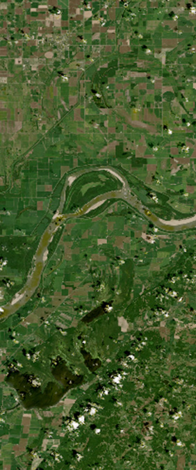
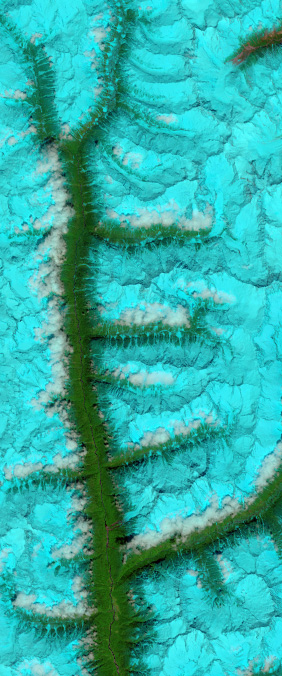
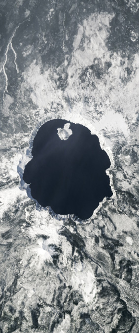
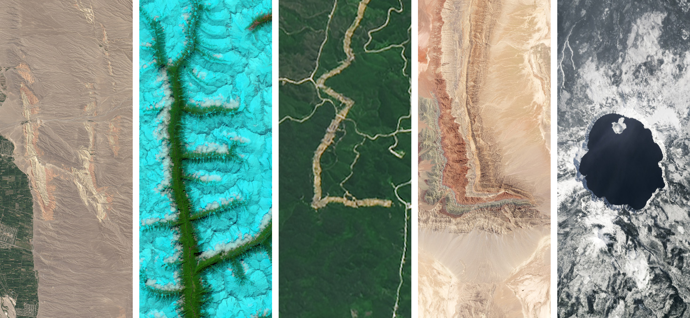

# 🛰️ NasaGeoSpeller

Batch download NASA Landsat satellite imagery for any text. Instead of typing words one by one on NASA's "Your Name in Landsat" website, feed in your text and get all the images at once.

## 🌍 How it Works

NasaGeoSpeller maps each character in your text to a real Landsat satellite image, downloads all the images, and stitches each word into a single PNG. Each letter has multiple satellite-image variants — repeated letters automatically cycle through them so you get different geological formations.

Optionally, it generates a `locations.txt` file with the **location name** and/or **geographic coordinates** for every image.

## 🖼️ Examples

**Individual letter tiles** — each one is a real satellite photo of a location on Earth:

| A | E | O |
|---|---|---|
|  |  |  |
| Hickman, Kentucky | Firn-filled Fjords, Tibet | Crater Lake, Oregon |

**Stitched output** — letters combined into one PNG per word:



> `hello` → h_0 (Southwestern Kyrgyzstan) · e_0 (Firn-filled Fjords, Tibet) · l_0 (Nusantara, Indonesia) · l_1 (Xinjiang, China) · o_0 (Crater Lake, Oregon)

Notice the two L's use different satellite images — the tool cycles through all available variants.

## 🚀 Quick Start

```bash
git clone https://github.com/Hevarh1/NasaGeoSpeller.git
cd NasaGeoSpeller
npm install
npm run setup          # downloads all 73 letter images from NASA
node src/index.js "hello world" --locations --coordinates
```

Output in `./output/hello world/`:

```
hello.png
world.png
locations.txt
```

## 📂 Output

Each word becomes one stitched PNG with all letter tiles side by side (5% gap between tiles, matching NASA's layout). A `locations.txt` is generated when you use `--locations` and/or `--coordinates`:

```
h_0 | Southwestern Kyrgyzstan | 40°14'03.6 N 71°14'22.8 E
e_0 | Firn-filled Fjords, Tibet | 29°15'46.9 N 96°19'03.8 E
l_0 | Nusantara, Indonesia | 0°58'18.1 S 116°41'58.9 E
l_1 | Xinjiang, China | 40°04'02.8 N 77°40'00.7 E
o_0 | Crater Lake, Oregon | 42°56'10.0 N 122°06'04.7 W
```

## 🛠️ Requirements

* **Node.js** (v14 or higher)

## 🚀 Installation

1. **Clone the repository:**
   ```bash
   git clone https://github.com/Hevarh1/NasaGeoSpeller.git
   cd NasaGeoSpeller
   ```

2. **Install dependencies:**
   ```bash
   npm install
   ```

3. **Download the satellite images:**
   ```bash
   npm run setup
   ```
   This fetches all letter variants from NASA's servers (73 images total). Re-running it only downloads new variants — if NASA adds images, run it again to pick them up. It also refreshes the location/coordinate metadata from NASA's interactive.

   ```
   🛰️  Downloading NASA Landsat letter images...
     ✅ A/0 (new)
     ✅ A/1 (new)
     ...
   📦 A: 5 variant(s)
   📦 B: 2 variant(s)
   ...
   🎉 Done! 73 new, 0 cached.
   📋 Metadata refreshed: 73 entries
   ```

## 🎬 Usage

### Quick — type your text directly:
```bash
node src/index.js "hello world"
```

### From a file:
```bash
node src/index.js --file input/lyrics.txt
```

### Batch mode (all .txt files in /input):
```bash
node src/index.js
```

### With location names:
```bash
node src/index.js "hello world" --locations
```

### With coordinates:
```bash
node src/index.js "hello world" --coordinates
```

### With both:
```bash
node src/index.js "hello world" --locations --coordinates
```

## 📁 Input Examples

Place any `.txt` file in the `/input` folder for batch mode:

**`hello.txt`**
```
hello world
```

**`lyrics.txt`**
```
Is this the real life
Is this just fantasy
Caught in a landslide
No escape from reality
```

**`pangram.txt`**
```
the quick brown fox jumps over the lazy dog
```

Special characters and numbers are stripped automatically — only a–z letters produce images. Casing doesn't matter.

## ⚙️ Options

| Flag | Description |
|------|-------------|
| `--locations` | Include location name for each image in `locations.txt` |
| `--coordinates` | Include geographic coordinates for each image in `locations.txt` |
| `--file`, `-f` | Read text from a file instead of command-line argument |
| (no args) | Process all `.txt` files found in `/input` |

## 🗂️ Project Structure

```
nasageospeller/
├── assets/             # Downloaded letter images (one folder per letter)
│   ├── a/              #   a/0.jpg, a/1.jpg, a/2.jpg …
│   ├── b/
│   ├── ...
│   └── z/
├── examples/           # Sample output images for this README
├── input/              # Drop .txt files here for batch mode
├── output/             # Generated PNGs appear here
├── scripts/
│   └── download_assets.js
├── src/
│   ├── index.js        # CLI entry point
│   └── processor.js    # Image stitching logic
├── .gitignore
├── package.json
└── README.md
```

## ⚖️ Credits

* Images provided by the NASA/USGS Landsat Science team.
* Source: [Your Name in Landsat](https://science.nasa.gov/specials/your-name-in-landsat/)
